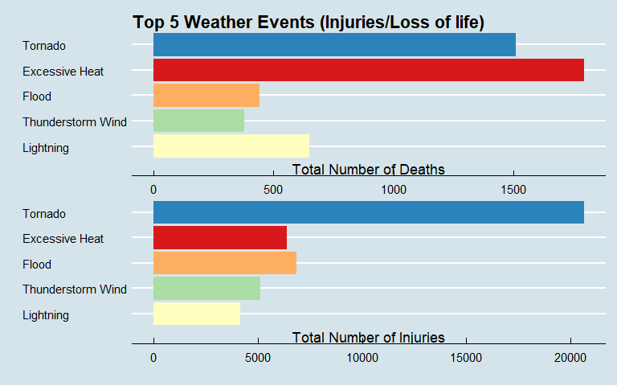
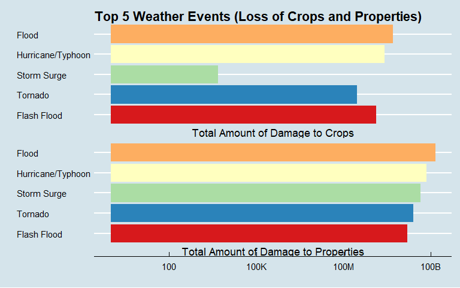

## Top Severe Weather Phenomena in the United States (1996-2011)

## Synopsis
In this simple analysis we aim to identify which meteorological phenomenon is the most detrimental to population health and which has the most impact with regards to economic repercussions across the United States from 1996 to 2011. To do such, we obtained data from the U.S. National Oceanic and Atmospheric Administration's (NOAA) storm database as collected by the National Weather Service(NWS). Specifically, we looked at fatalities and injuries as significant factors that are harmful to population health, whereas property and crop damage was used to discern event/s that have the greatest economic consequences.

## Data Processing

We obtained data from version 3 of [NOAA's storm events database](https://www.ncdc.noaa.gov/stormevents/) which contains consolidated weather events from 1950 to 2011. 

### Reading the data

We read in the data from a comma-separated-value file compressed via the bzip2 algorithm to reduce its size.


```r
> library(magrittr)
> library(data.table)
> library(tidyverse)
> library(ggthemes)
> library(RColorBrewer)
> 
> 
> url <- "https://d396qusza40orc.cloudfront.net/repdata%2Fdata%2FStormData.csv.bz2"
> df <- fread(url)
```

After reading in, we check the dimensions of our data table.


```r
> dim(df)
```

```
[1] 902297     37
```

Apparently, the data has **902297** rows and **37** columns. Note that each observation refers to a specific 
storm episode with each column describing specific details about the event. 
As we can see, working with this much data could easily obscure
our analysis so we first check out the column labels.


```r
> colnames(df)
```

```
 [1] "STATE__"    "BGN_DATE"   "BGN_TIME"   "TIME_ZONE"  "COUNTY"    
 [6] "COUNTYNAME" "STATE"      "EVTYPE"     "BGN_RANGE"  "BGN_AZI"   
[11] "BGN_LOCATI" "END_DATE"   "END_TIME"   "COUNTY_END" "COUNTYENDN"
[16] "END_RANGE"  "END_AZI"    "END_LOCATI" "LENGTH"     "WIDTH"     
[21] "F"          "MAG"        "FATALITIES" "INJURIES"   "PROPDMG"   
[26] "PROPDMGEXP" "CROPDMG"    "CROPDMGEXP" "WFO"        "STATEOFFIC"
[31] "ZONENAMES"  "LATITUDE"   "LONGITUDE"  "LATITUDE_E" "LONGITUDE_"
[36] "REMARKS"    "REFNUM"    
```

Information about these variables can be accessed [here](https://d396qusza40orc.cloudfront.net/repdata%2Fpeer2_doc%2Fpd01016005curr.pdf). Moreover, details about the accuracy of the data are discussed [here](https://d396qusza40orc.cloudfront.net/repdata%2Fpeer2_doc%2FNCDC%20Storm%20Events-FAQ%20Page.pdf). Also, the data contains information from **1950** to **2011**, but 
we will include only data from **1996** to **2011** for our analysis because of the following statements:
 
>>`` 1. Tornado: From 1950 through 1954, only tornado events were recorded.
>> 
>> 2. Tornado, Thunderstorm Wind and Hail: From 1955 through 1992, only tornado, thunderstorm wind and hail events were keyed from the paper publications into digital data. From 1993 to 1995, only tornado, thunderstorm wind and hail events have been extracted from the Unformatted Text Files.
>> 
>> 3. All Event Types (48 from Directive 10-1605): From 1996 to present, 48 event types are recorded as defined in NWS Directive 10-1605.``

> Source: https://www.ncdc.noaa.gov/stormevents/details.jsp?type=eventtype

Specifically, we will look at these columns; 

| Variable |      Description |
| ------ | ----------- |
| BGN_DATE | The date at which the weather event started |
| EVTYPE   | The type of weather event (e.g. Hail, Thunderstorm Wind, etc) |
| FATALITIES | The number of deaths related to the weather event|
| INJURIES   | The number of injuries related to the weather event|
| PROPDMG   | The estimated amount of damage to property incurred by the weather event (e.g. 10.00K = \$10,000 ; 10.00M = \$10,000,000)  |
| PROPDMGEXP |  Unit of measure or multiplier for PROPDMG value (e.g. K = \$1,000; M = \$1,000,000) |
| CROPDMG  | The estimated amount of damage to crops incurred by the weather event   (e.g. 10.00K = \$10,000; 10.00M = \$10,000,000) |
| CROPDMGEXP  | Unit of measure or multiplier for CROPDMG value (e.g. K = \$1,000; M = \$1,000,000) |

### Transforming the data

We filter the data using only the aforementioned variables. In addition, we 
exclude the data that have zero values on **all** of these variables since we are only interested at the event that is most detrimental to health and economy. 


```r
> storm_data <- df %>%
+   select(
+     BGN_DATE, EVTYPE, FATALITIES, INJURIES,
+     PROPDMG, PROPDMGEXP, CROPDMG, CROPDMGEXP
+   ) %>%
+   filter(
+     FATALITIES != 0 | INJURIES != 0 | PROPDMG != 0 | CROPDMG != 0
+   )
> 
> dim(storm_data)
```

```
[1] 254633      8
```

The new data table gives us **254633** rows and **8** columns. We look at the first few rows of the dataset.


```r
> storm_data <- as_tibble(storm_data)
> head(storm_data)
```

```
# A tibble: 6 x 8
  BGN_DATE      EVTYPE FATALITIES INJURIES PROPDMG PROPDMGEXP CROPDMG CROPDMGEXP
  <chr>         <chr>       <dbl>    <dbl>   <dbl> <chr>        <dbl> <chr>     
1 4/18/1950 0:~ TORNA~          0       15    25   K                0 ""        
2 4/18/1950 0:~ TORNA~          0        0     2.5 K                0 ""        
3 2/20/1951 0:~ TORNA~          0        2    25   K                0 ""        
4 6/8/1951 0:0~ TORNA~          0        2     2.5 K                0 ""        
5 11/15/1951 0~ TORNA~          0        2     2.5 K                0 ""        
6 11/15/1951 0~ TORNA~          0        6     2.5 K                0 ""        
```


```r
> head(storm_data$BGN_DATE)
```

```
[1] "4/18/1950 0:00:00"  "4/18/1950 0:00:00"  "2/20/1951 0:00:00" 
[4] "6/8/1951 0:00:00"   "11/15/1951 0:00:00" "11/15/1951 0:00:00"
```

We convert `BGN_DATE` to datetime object and then extract the year. We filter the 
data for the years **1996-2011**.


```r
> storm_data$BGN_DATE <-
+   gsub(
+     pattern = "(.*)\\s(.*)",
+     replacement = "\\1",
+     storm_data$BGN_DATE
+   ) %>%
+   as.Date(format = "%m/%d/%Y")
> 
> storm_data <-
+   storm_data %>%
+   filter(year(BGN_DATE) %in% 1996:2011)
> 
> storm_data$BGN_DATE %>%
+   year() %>%
+   unique() %>%
+   sort()
```

```
 [1] 1996 1997 1998 1999 2000 2001 2002 2003 2004 2005 2006 2007 2008 2009 2010
[16] 2011
```

The next step is to merge `PROPDMG` with their corresponding unit/multiplier, `PROPDMGEXP`, as well as `CROPDMG` with `CROPDMGEXP`. Here we will explore the contents of `PROPDMGEXP` and `CROPDMGEXP` variables.


```r
> unique(storm_data$PROPDMGEXP)
```

```
[1] "K" ""  "M" "B"
```


```r
> unique(storm_data$CROPDMGEXP)
```

```
[1] "K" ""  "M" "B"
```

An effort was made to determine what these values imply at which more details can be found [here](https://rstudio-pubs-static.s3.amazonaws.com/58957_37b6723ee52b455990e149edde45e5b6.html). With that, we can assure the validity of the following association:

* H,h = hundreds = 100
* K,k = kilos = thousands = 1,000
* M,m = millions = 1,000,000
* B,b = billions = 1,000,000,000
* black/empty character = 0

We then change these values with their corresponding actual value.


```r
> storm_data$PROPDMGEXP <-
+   case_when(
+     grepl("[Hh]", storm_data$PROPDMGEXP) ~ 10^2,
+     grepl("[Kk]", storm_data$PROPDMGEXP) ~ 10^3,
+     grepl("[Mm]", storm_data$PROPDMGEXP) ~ 10^6,
+     grepl("[Bb]", storm_data$PROPDMGEXP) ~ 10^9,
+     grepl("(^$)", storm_data$PROPDMGEXP) ~ 0,
+   )
> 
> unique(storm_data$PROPDMGEXP)
```

```
[1] 1e+03 0e+00 1e+06 1e+09
```


```r
> storm_data$CROPDMGEXP <-
+   case_when(
+     grepl("[Kk]", storm_data$CROPDMGEXP) ~ 10^3,
+     grepl("[Mm]", storm_data$CROPDMGEXP) ~ 10^6,
+     grepl("[Bb]", storm_data$CROPDMGEXP) ~ 10^9,
+     grepl("(^$)", storm_data$CROPDMGEXP) ~ 0
+   )
> 
> unique(storm_data$CROPDMGEXP)
```

```
[1] 1e+03 0e+00 1e+06 1e+09
```

We now use `PROPDMGEXP` and `CROPDMGEXP` as multipliers for the values of
property damages (`PROPDMG`) and crop damages (`CROPDMG`) respectively.


```r
> storm_data <-
+   storm_data %>%
+   rename_with(tolower) %>%
+   mutate(
+     bgn_date = year(bgn_date),
+     propdmg = propdmg * as.double(propdmgexp),
+     cropdmg = cropdmg * as.double(cropdmgexp),
+   ) %>%
+   select(
+     year = bgn_date,
+     evtype, fatalities, injuries, propdmg, cropdmg
+   ) %>%
+   arrange(year)
> 
> storm_data
```

```
# A tibble: 201,318 x 6
    year evtype       fatalities injuries propdmg cropdmg
   <int> <chr>             <dbl>    <dbl>   <dbl>   <dbl>
 1  1996 WINTER STORM          0        0  380000   38000
 2  1996 TORNADO               0        0  100000       0
 3  1996 TSTM WIND             0        0    3000       0
 4  1996 TSTM WIND             0        0    5000       0
 5  1996 TSTM WIND             0        0    2000       0
 6  1996 HIGH WIND             0        0  400000       0
 7  1996 TSTM WIND             0        0   12000       0
 8  1996 TSTM WIND             0        0    8000       0
 9  1996 TSTM WIND             0        0   12000       0
10  1996 FLASH FLOOD           0        0   75000       0
# ... with 201,308 more rows
```

We can further tidy the data by fixing the discrepancies(e.g. typo errors) on the `evtype` column. Also, [the number of official
event types are only 48](https://d396qusza40orc.cloudfront.net/repdata%2Fpeer2_doc%2Fpd01016005curr.pdf) however we have 222 unique events on this column.


```r
> length(unique(storm_data$evtype))
```

```
[1] 222
```

Going through each of the event and manually fact-checking each on the [database](https://www.ncdc.noaa.gov/stormevents/choosedates.jsp?statefips=1%2CALABAMA) is one way to fix this column albeit a tedious task. Thus, for the purpose of this analysis we will only look at some patterns for the `20` most frequent events.


```r
> table(storm_data$evtype) %>%
+   sort(decreasing = TRUE) %>%
+   head(n = 20)
```

```

           TSTM WIND    THUNDERSTORM WIND                 HAIL 
               61775                43097                22679 
         FLASH FLOOD              TORNADO            LIGHTNING 
               19011                12366                11152 
               FLOOD            HIGH WIND          STRONG WIND 
                9513                 5402                 3367 
        WINTER STORM           HEAVY RAIN           HEAVY SNOW 
                1460                 1047                 1029 
            WILDFIRE URBAN/SML STREAM FLD       EXCESSIVE HEAT 
                 847                  702                  685 
           ICE STORM       TSTM WIND/HAIL       TROPICAL STORM 
                 631                  441                  410 
      WINTER WEATHER     WILD/FOREST FIRE 
                 405                  381 
```

After matching these events with the information on the [database](https://www.ncdc.noaa.gov/stormevents/choosedates.jsp?statefips=1%2CALABAMA),
it turns out that the following are exactly the same as the value on the right:

* TSTM WIND -> THUNDERSTORM WIND
* TSTM WIND/HAIL -> THUNDERSTORM WIND
* THUNDERSTORM WINDS -> THUNDERSTORM WIND
* HIGH WINDS -> HIGH WIND 
* URBAN/SML STREAM FLD -> FLOOD

We then alter these values. Moreover, we convert each element to title case and remove leading and trailing whitespace.


```r
> storm_data$evtype <-
+   storm_data$evtype %>%
+   trimws() %>%
+   str_to_title() %<>%
+   str_replace("(.*)\\s\\W*\\d+\\W*", "\\1") %<>%
+   str_replace("(.*)\\s\\W*\\w{1}\\d+\\W*", "\\1") %>%
+   trimws() %<>%
+   gsub(
+     pattern = "Tstm Wind|Tstm Winds|Tstmw|Tstm Wind/Hail|Thunderstorm Winds",
+     replacement = "Thunderstorm Wind"
+   ) %<>%
+   gsub(
+     pattern = "Thunderstorm  Winds|Marine Tstm Wind|Thunderstorm Windss",
+     replacement = "Thunderstorm Wind"
+   ) %<>%
+   gsub(
+     pattern = "Thunderstorm Winds/Hail|Thunderstorms Winds",
+     replacement = "Thunderstorm Wind"
+   ) %<>%
+   gsub(
+     pattern = "Thunderstorm Wind/Hail|Thunderstorm Winds Hail",
+     replacement = "Thunderstorm Wind"
+   ) %<>%
+   gsub(
+     pattern = "High Winds", replacement = "High Wind"
+   ) %<>%
+   gsub(
+     pattern = "Urban/Sml Stream Fld|Flooding", replacement = "Flood"
+   ) %<>%
+   gsub(
+     pattern = "Flash Flooding", replacement = "Flash Flood"
+   ) %<>%
+   gsub(
+     pattern = "^.*/(Excessive Heat)", replacement = "\\1"
+   )
> 
> table(storm_data$evtype) %>%
+   sort(decreasing = TRUE) %>%
+   head(n = 20)
```

```

Thunderstorm Wind              Hail       Flash Flood           Tornado 
           105369             22679             19012             12366 
        Lightning             Flood         High Wind       Strong Wind 
            11152             10215              5405              3369 
     Winter Storm        Heavy Rain        Heavy Snow          Wildfire 
             1460              1047              1029               847 
   Excessive Heat         Ice Storm    Tropical Storm    Winter Weather 
              685               631               410               405 
 Wild/Forest Fire       Rip Current         Avalanche           Drought 
              381               364               264               258 
```

## Results

We divide our exploration into two parts. First, we look at the variables,
`fatalities` and `injuries` to determine which event has the biggest impact
on population health and then investigate `propdmg` and `cropdmg` with regards
to economic loss.

### Most Harmful on Population Health

We summarize the total fatalities and total injuries per weather event, 
sort the data in a descending order and then collect only the top five
most harmful events.


```r
> bad_on_pop_health_top5 <-
+   storm_data %>%
+   group_by(evtype) %>%
+   summarise(
+     total_deaths = sum(fatalities),
+     total_injuries = sum(injuries)
+   ) %>%
+   arrange(desc(total_deaths)) %>%
+   top_n(5)
> 
> bad_on_pop_health_top5
```

```
# A tibble: 5 x 3
  evtype            total_deaths total_injuries
  <chr>                    <dbl>          <dbl>
1 Excessive Heat            1797           6391
2 Tornado                   1511          20667
3 Lightning                  651           4141
4 Flood                      442           6837
5 Thunderstorm Wind          378           5128
```

It turns out that _Excessive Heat_ events have the most fatalities with _Tornado_ events close in second, whereas _Tornado_ events have inflicted the most injuries. 

We inspect `fatalities` and `injuries` columns graphically.


```r
> bad_on_pop_health_top5 %>%
+   pivot_longer(-evtype) %>%
+   ggplot(aes(
+     x = reorder(evtype, value),
+     y = value,
+     fill = evtype
+   )) +
+   geom_bar(stat = "identity") +
+   theme_economist() +
+   scale_fill_brewer(palette = "Spectral") +
+   theme(legend.position = "none") +
+   labs(
+     x = "", y = "",
+     title = "Top 5 Weather Events (Injuries/Loss of life)"
+   ) +
+   facet_wrap(name ~ .,
+     ncol = 1,
+     scales = "free",
+     labeller = labeller(
+       name = c(
+         `total_injuries` = "Total Number of Injuries",
+         `total_deaths` = "Total Number of Deaths"
+       )
+     ),
+     strip.position = "bottom"
+   ) +
+   coord_flip()
```

<!-- -->

For the purpose of this simple analysis, we can assume that **`Tornado`** `is the most detrimental weather event to population health with respect to` `both the number of injuries and deaths inflicted.`

### Most Impact on Economy

We summarize the total crop damage and total property damage per weather event, sort the data in a descending order and then collect only the top five weather events. 


```r
> bad_on_economy_top5 <-
+   storm_data %>%
+   group_by(evtype) %>%
+   summarise(
+     total_crop_damage = sum(cropdmg),
+     total_property_damage = sum(propdmg)
+   ) %>%
+   arrange(desc(total_crop_damage)) %>%
+   top_n(5)
> 
> bad_on_economy_top5
```

```
# A tibble: 5 x 3
  evtype            total_crop_damage total_property_damage
  <chr>                         <dbl>                 <dbl>
1 Flood                    4983266500          144003143200
2 Hurricane/Typhoon        2607872800           69305840000
3 Flash Flood              1334901700           15222253910
4 Tornado                   283425010           24616945710
5 Storm Surge                    5000           43193536000
```

We then visually inspect these events. 

```r
> bad_on_economy_top5 %>%
+   pivot_longer(-evtype) %>%
+   ggplot(aes(
+     x = reorder(evtype, value),
+     y = value,
+     fill = evtype
+   )) +
+   geom_bar(stat = "identity") +
+   scale_y_continuous(trans = "log10",
+                      labels = c("100", "100K", "100M", "100B"),
+                      breaks = c(10^2, 10^5, 10^8, 10^11)) +
+   theme_economist() +
+   scale_fill_brewer(palette = "Spectral") +
+   theme(legend.position = "none") +
+   labs(
+     x = "", y = "",
+     title = "Top 5 Weather Events (Loss of Crops and Properties)"
+   ) +
+   facet_wrap(name ~ .,
+     ncol = 1,
+     labeller = labeller(
+       name = c(
+         `total_crop_damage` = "Total Amount of Damage to Crops",
+         `total_property_damage` = "Total Amount of Damage to Properties"
+       )
+     ),
+     strip.position = "bottom"
+   ) +
+   coord_flip()
```

<!-- -->

Considering both crop and property damage, we can say that **`Flood`** `events have`
`been the most devastating.`

### Summary

Through exploratory data analysis, we were able to identify weather
phenomena that have tremendous impact on population health and on economy.
**`Tornado`** has been identified as the most harmful to population health in
the U.S. from 1996 to 2011 with respect to both injuries and loss of life. On
the other hand, **`Flood`** has been the most catastrophic with regards to 
economic loss due to crop and property damages. 


